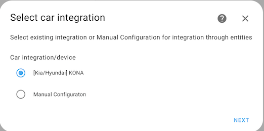

# Salix Charging Controller
[Home Assistant](https://www.home-assistant.io/) integration component, part of [Salix Project](https://github.com/artursulkowski/salix)

SLX Charging Controller controls EVSE (aka. charger) based on car battery state of charge (SOC). It makes decision about when charging should be enabled to:
* Immediatelly charge your car to avoid battery staying in low SOC
* Stop charging before battery is fully charged to avoid accelerated degradation.

For operation, SLX Charging Controller requires other Home Assistant integrations:
* Car's integration - to check battery SOC
* EVSE integration - to control charging process

For supported integration, configuration process is simplified. However, manual integration using entities is also possible.

**Supported car's integrations:**
| Car integration | Brand | Comment  |
| --- | --- | ---|
| [kia_uvo](https://github.com/Hyundai-Kia-Connect/kia_uvo) | Kia( UVO) <br> Hyundai (Bluelink) | Tested with: <br> Hyundai Kona|
| Manual Configuration <br> <sub> TODO link to description| N/A | You can select entity with SOC|
| Planned:  [BMW Connected Drive](https://www.home-assistant.io/integrations/bmw_connected_drive/)|BMW| (planned) |

**Supported EVSE integrations:**
| EVSE integration | Brand | Comment  |
| --- | --- | ---|
| [OpenEVSE](https://github.com/firstof9/openevseo) | [OpenEVSE](https://www.openevse.com/) | Tested |
| Manual Configuration <br> <sub> TODO link to description | N/A | You can select entity with SOC|

## How it works
Exemplary scenario:
1. You are connecting quite discharged car to the charger (e.g. SOC is 8%)
1. SLXCharging controller - checks SOC
1. Because SOC it is below `SOC Limit Min` (20%).
Charging starts immediatelly with full power.
1. Charging contrinues untill SOC reaches 20%.
1. Then charger is switched to PVCharge mode (charging from excess energy produced).
1. SLX Charging Controller monitors battery SOC and if it exceeds SOC Limit Max (e.g. 80%), charger is switched to STOPPED mode (no charging active).

## How you control it
Integration have few entities you can use to control it


### Entity: Charge Method
This entity allows you to control in which mode SLX Charging Controller is working.
You can select ECO mode for charging using excess solar energy produced at house (EVSE must support it).
You can also switch to FAST mode which will make sure your car is charged immediatelly to requires SOC.

| Charge Method <br> value   | Description  |
| ---| --- |
| ECO <br> <sup> default</sup> | Keeps SOC between `SOC Limit Min` and `SOC Limit Max`<br> Uses both normal charging (full power available) and PVCharge (charging with excess energy)|
| FAST | Runs normal charging until car reaches `SOC targer` |
| MANUAL | Disables automation built-in SLX charging Controller. You can then manually set charger mode using `Charge mode` entity |

### Enity: Charge mode
In typical scenario value of this entity is changed by SLX Charging Controller. It represents state of EVSE.
| Charge Mode values | Description  |
| ---| --- |
| STOPPED| Charging is stopped |
| PVCHARGE| EVSE is charging car using only excess energy produced by Solar |
| NORMAL CHARGE| EVSE is charging car using it's default power setting|
| UNKNOWN| EVSE state was not read or set by SLX Charging Controller (usually after restart)|

### SOC entities
You can easily modify values of expected SOC in different scenarios

| SOC related entities   | Description  |
| ---| --- |
| SOC Limit Min <br> <sup> default = 20% </sup> | Minimum SOC that system tries to keep <br> Regardless of selected mode (Even in ECO)|
SOC Limit Max <br> <sup> default = 80% </sup> | Maximum SOC kept when charging in ECO mode <br> can be overwritten by SOC target |
SOC target <br> <sup> default = 20% </sup> | In `Charge Method` = `FAST` charging is run until SOC = `SOC target` is reached <br> In `Charge Method` = `ECO` you can temporarily increase maximum SOC    |


### Output entities
Integration also defines few entities informing you about current status


## How to install

1. Login to Home Assistant console using SSH (You can use [Terminal&SSH add-on](https://github.com/home-assistant/addons/tree/master/ssh) to open console directly in browser)
1. Go into customer_components directory
    ```
    [core-ssh /$] cd /config/custom_components/
    ```
1. Copy repository
    ```
    git clone https://github.com/artursulkowski/slxchargingcontroller.git
    ```
1. Add integration

## How to configure
SLX Charging Controller automatically detects supported car and EVSE integrations.





### Manual setup


| Input     | Unit of Measurement | Device Class | Description  |
| ---| --- | --- | --- |
| EVSE Session Energy | kWh, Wh | any | amount of energy added during charging session |
| EVSE | any | plug | Status of charger's plug: On - pluged in, Off - unpluged |


| Input     | Unit of Measurement | Device Class | Description  |
| ---| --- | --- | --- |
| Car SOC | % | any | Car's battery SOC |
| Car SOC Update time | any | timestamp | Time in which Car SOC was read. In an ideal world we could use [state.last_updated](https://www.home-assistant.io/docs/configuration/state_object/), but in case of [Hyundai-Kia-Connect](https://github.com/Hyundai-Kia-Connect/kia_uvo) real update time is stored in separate entity |

## Known issues
Project is still at early stage of development. I am still discovering small issues at my own setup.
I aim to register them in [issues](https://github.com/artursulkowski/slxchargingcontroller/issues)

## Want to contribute?
At the moment my goal is to increase number of supported integrations of both cars and EVSE.


(TODO - add link)
To be described
