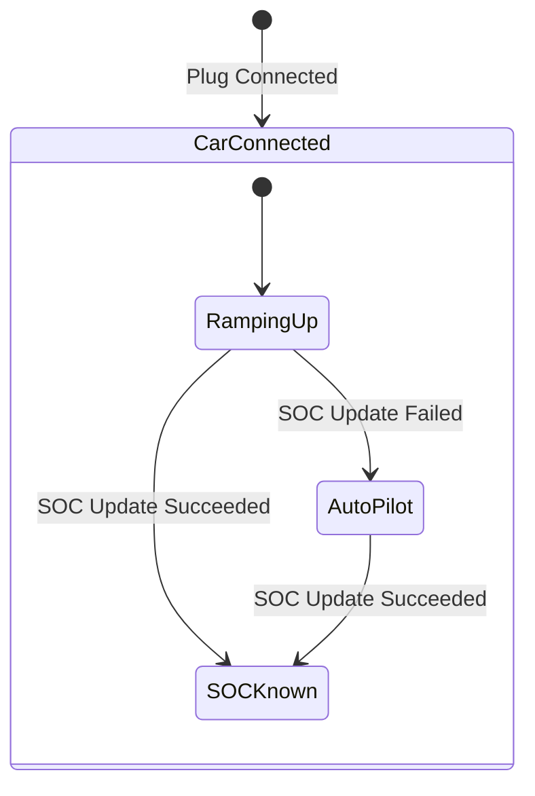
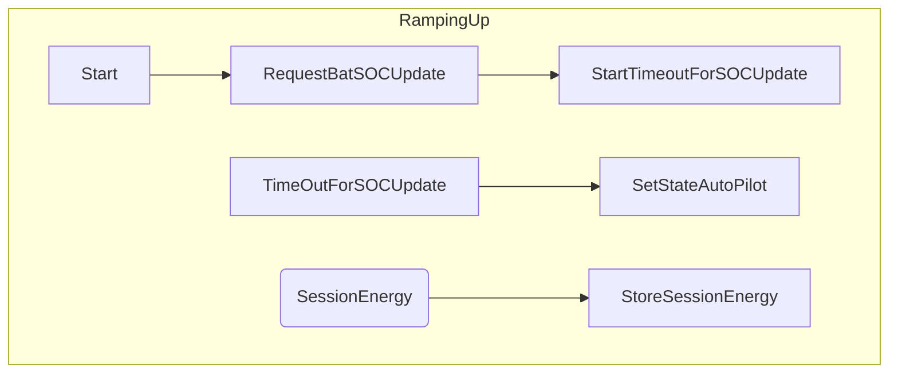
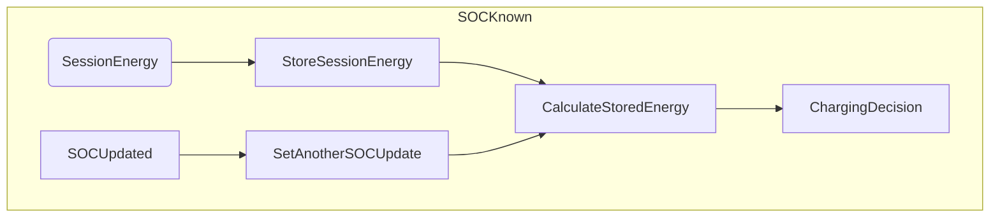
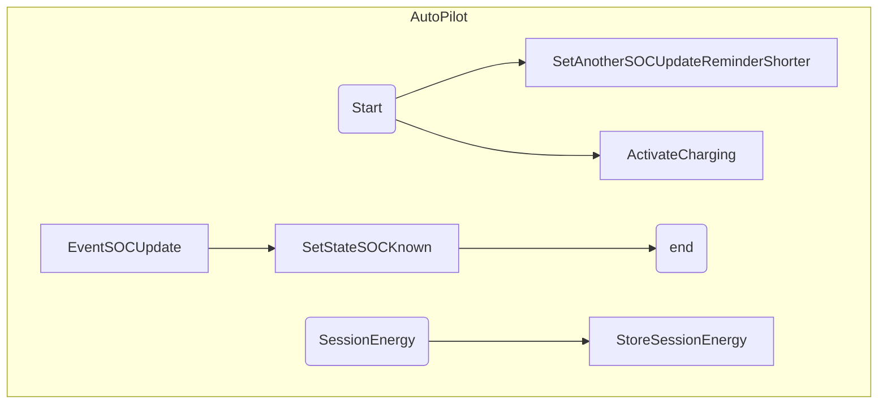

# Technical design
Integration is using [entities](https://developers.home-assistant.io/docs/core/entity/) already registered in HA to obtain information about EV battery SOC, current charging status.
At intergration's configuration user can select input entities which are fitting required input data.

Why use entities as intergration's input?
* Very flexible solution - can connect to multiple other integrations already exisiting in the system.
* Easy development - can use HA WebUI "States" to modify value of entity for testing and troubleshooting purpose.

Disadvantages:
* Requires a lot of manual configuration.
* Error prone.

## Input entities:

| Input     | Unit of Measurement | Device Class | Description  |
| ---| --- | --- | --- |
| EVSE Session Energy | kWh, Wh | any | amount of energy added during charging session |
| EVSE | any | plug | Status of charger's plug: On - pluged in, Off - unpluged |
| Car SOC | % | any | Car's battery SOC |
| Car SOC Update time | any | timestamp | Time in which Car SOC was read. In ideal world we could use [state.last_updated](https://www.home-assistant.io/docs/configuration/state_object/), but in case of [Hyundai-Kia-Connect](https://github.com/Hyundai-Kia-Connect/kia_uvo) real update time is stored in separate entity |

## Charging Controller Algorithm

States:
* RampingUp - car is connected but we didn't get SOC, waiting for it. Don't start charging yet
* AutoPilot - we didn't get SOC. We are not estimating energy. However we activate charger - so user avoids situation that charging is blocked just because we cannot read correct
* SOCKnown - at this state we are estimating SOC and we are controlling the charger according to charging plan.

SOC Updates - state vs time of update
In case of first prototype setup (Kia&Hyundai integration) SOC value (ev_battery_level) and time when this level was checked (car_last_updated_at) are two separate entities.
I will combine these two values into pair of  (SOCLevel, SOCUpdateTime) in SLXChgCtrlUpdateCoordinator and deliver combined values into SLXChargingController.
Therefore algorithms described here are ignoring the need to asynchronously combine these two values.

